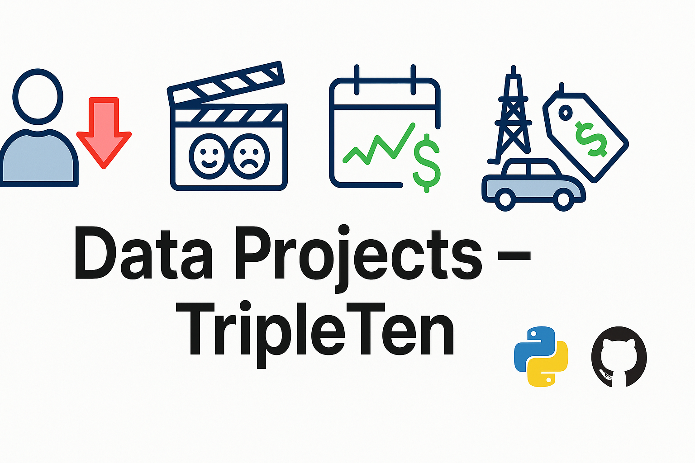

## Hi there 👋

<!--
**laninchowdhury/laninchowdhury** is a ✨ _special_ ✨ repository because its `README.md` (this file) appears on your GitHub profile.

-->
<p align="center">
  
</p>


# 👋 Hi, I'm Lanin Chowdhury

🎓 Data science graduate from TripleTen  
🔍 Passionate about solving real-world problems with **Python, Machine Learning, and Data Analysis**  
📊 From sentiment classification to customer churn and profitability forecasting

---

## 🔧 Projects at a Glance

| Project                        | Domain      | ML Task         | Tools Used                         |
|-------------------------------|-------------|------------------|------------------------------------|
| [Customer Churn Prediction](https://github.com/laninchowdhury/Data_projects_TripleTen/tree/main/Customer_Churn_Prediction) | Telecom      | Classification | Scikit-learn, pandas, matplotlib   |
| [IMDB Sentiment Classification](https://github.com/laninchowdhury/Data_projects_TripleTen/tree/main/IMDB_Sentiment_Classification) | NLP          | Sentiment Analysis | TF-IDF, Logistic Regression        |
| [Taxi Demand Forecasting](https://github.com/laninchowdhury/Data_projects_TripleTen/tree/main/Taxi_Demand_and_Forecasting) | Transportation | Time Series      | statsmodels, pandas                |
| [Oil Well Profitability](https://github.com/laninchowdhury/Data_projects_TripleTen/tree/main/Oil_Well_Profitability) | Energy       | Regression       | scikit-learn, seaborn              |
| [Used Car Price Analysis](https://github.com/laninchowdhury/Data_projects_TripleTen/tree/main/Used_Car_Price) | Automotive   | Price Prediction | Linear Models, Pandas              |
| [Beta Bank Churn (F1 Optimized)](https://github.com/laninchowdhury/Data_projects_TripleTen/tree/main/BetaBank_Churn_Prediction) | Banking      | Classification   | Random Forest, ROC-AUC, F1 Score   |

---

## 🧰 Tools & Tech

- Python, NumPy, pandas, Matplotlib, Seaborn  
- scikit-learn, statsmodels, NLTK, Plotly  
- Jupyter Notebook, Git & GitHub

---

## 🌐 Let's Connect!

📫 Email: **laninchowdhuryva@gmail.com**  
🔗 [LinkedIn](https://www.linkedin.com/in/laninchowdhury) | [GitHub](https://github.com/laninchowdhury)


``` |


